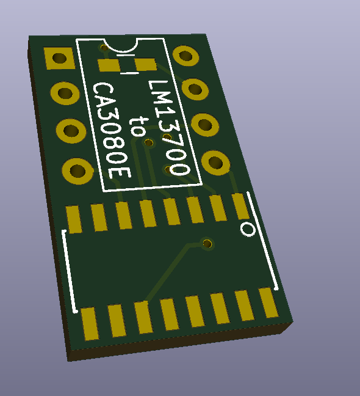

# LM13700_to_CA3080E_Adapter
Small adapter board to convert the still produced LM13700M (SOIC) to the CA3080E (out of production)

The adapter board has been tested and working (but with some compatibility issues in some scenarios) with the LM13700M without using the single 0603 resistor. In the datasheet, the diode bias was typically pulled high, so I added the footprint just in case it was necessary.

## Images
Board Front:  

